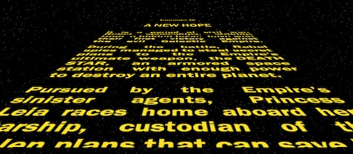

# Star wars crawl weap

François et moi allons essayer de faire une animation basée sur star wars.

## Cadre:
Cet exercice est effectué dans le cadre de notre troisième semaine de formation au centre de formation BECODE. 
Nous sommes en janvier 2021.

## Technos utilisées:
HTML5
CSS3

## Auteurs: 
François Chardon
Rekha Lambotte

## Instructions:
Le but est de faire défiler du texte comme dans le films Star Wars.
Le délai est de 1/2 journée.

## But à atteindre :

## Statut:
en cours

## Projet déployé: 
Lien Github : 

Lien web: 

